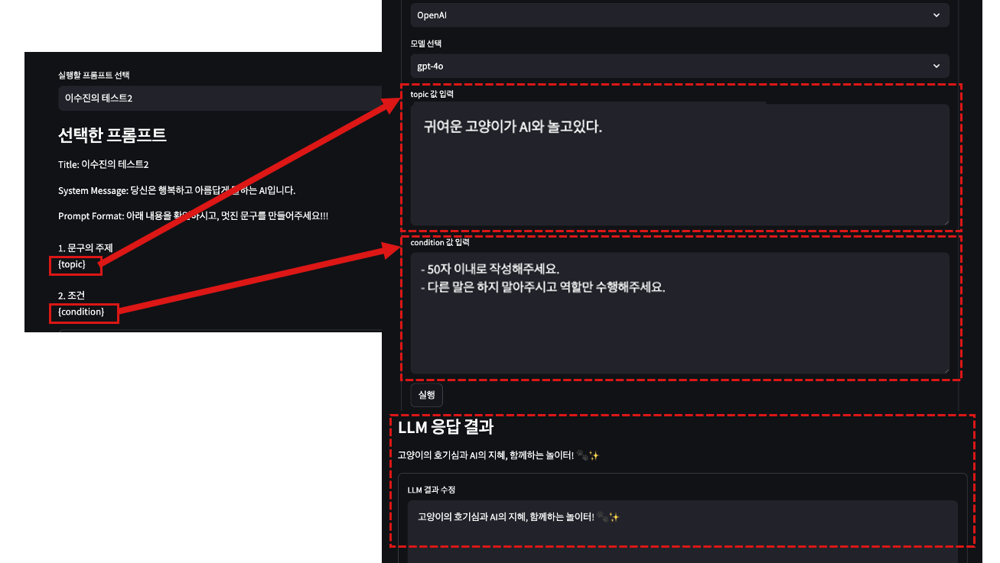
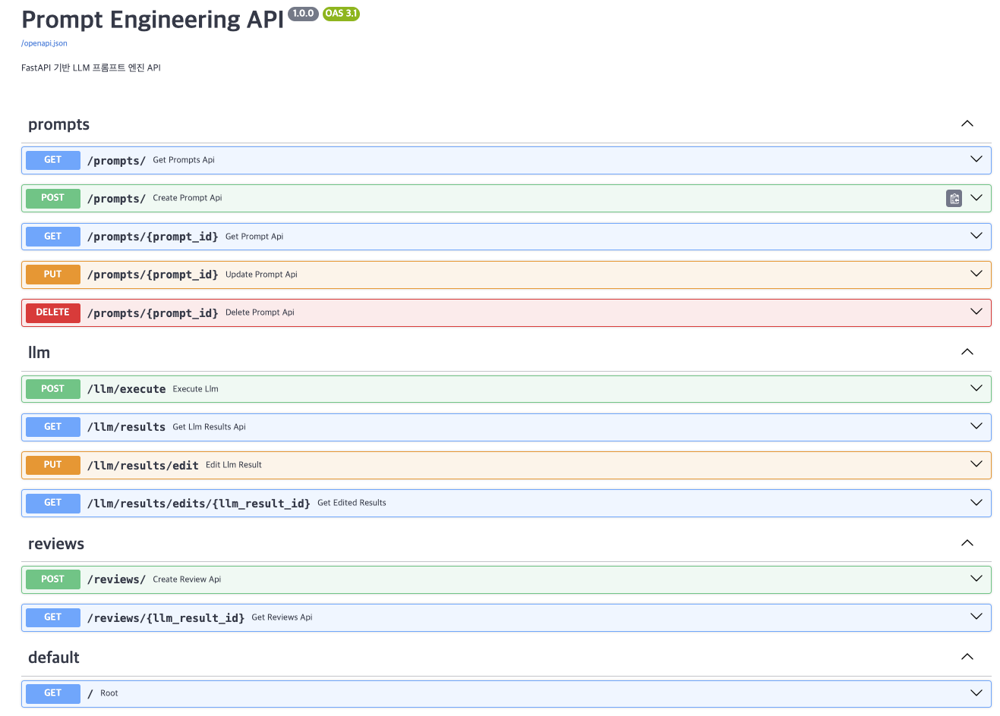

# prompt-playground-lab  
prompt tuning, management, playground lab(w/ Python Streamlit, FastAPI)

# Project Structure  
```bash  
prompt-tuning/   
│── app/     
│   ├── main.py                 # FastAPI 메인 파일
│   ├── db.py                   # MySQL 연결 및 테이블 자동 생성  
│   ├── models.py               # ORM 모델 정의  
│   ├── schemas.py              # API 스키마 정의  
│   ├── crud.py                 # CRUD 함수 정의  
│   ├── config.py               # 환경 변수 관리  
│   ├── core/                   # 핵심 기능 모듈    
│   │   ├── llm_service.py      # LLM API 호출 로직  
│   ├── routers/                # API 라우터들  
│   │   ├── __init__.py      
│   │   ├── prompt.py           # 프롬프트 CRUD 라우터  
│   │   ├── llm.py              # LLM 요청을 위한 라우터               
│   │   ├── review.py           # LLM 요청을 위한 라우터             
│── web/                  
│   ├── pages/                    
│   │   ├── info.py             # 정보 페이지  
│   │   ├── add_prompt.py       # 프롬프트 추가 페이지  
│   │   ├── manage_prompt.py    # 프롬프트 수정/삭제 페이지  
│   │   ├── execute_prompt.py   # LLM 실행 페이지  
│   │   ├── review_prompt.py    # 실행 이력 및 평가 페이지  
│   ├── main.py                 # streamlit main 파일  
│   ├── config.py               # streamit config 정보  
│── .env                        # 환경변수 설정 파일  
│── insert_test_data.sql        # MySQL 예제 데이터 추가  
│── requirements.txt            # 라이브러리 목록  
│── .gitignore                  # gitignore  
```

# How to use?

   

1. Install MySQL or MariaDB  
    1-1. Set user  
    1-2. Create database named 'prompt_db'  
2. Set python env  
3. Install python libaray(w/ requirements.txt)  
4. Write .env  
    4-1. Change the .env.tmp file namt to .env  
    4-2. Write content in .env  
    '''   
    DB_USER=    
    DB_PASS=     
    DB_HOST=    
    DB_PORT=      
    DB_NAME=    
    OPENAI_API_KEY=    
    OPENAI_MODEL=    
    '''  
5. Run fastapi server (Automatically proceed with database table setting)   
    - uvicorn app.main:app --reload   
       
6. (OPTION, insert test data) mysql -u root -p < insert_test_data.sql  
7. Run streamlit server  
    - streamlit run web/main.py --server.port 8501  

# More detail
- blog description: https://lsjsj92.tistory.com/679

